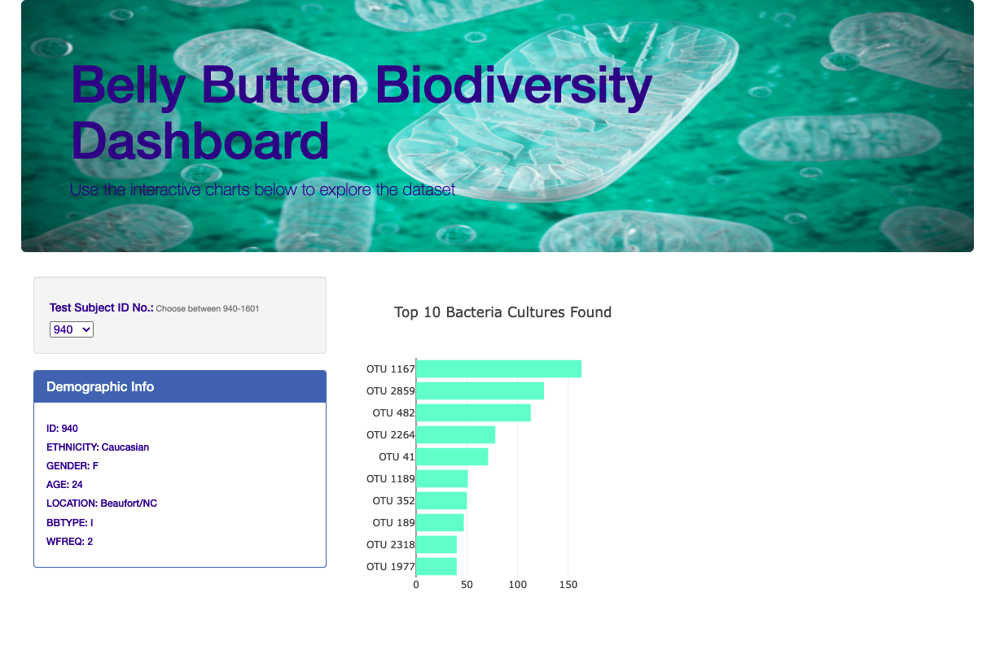

# Belly Button Biodiversity Bacterial Study 

Interactive webpage with visualizations to interact with data on the different types of bacteria found in a sample size of the human population's belly buttons. 

## Preview of Site Homepage 

 s